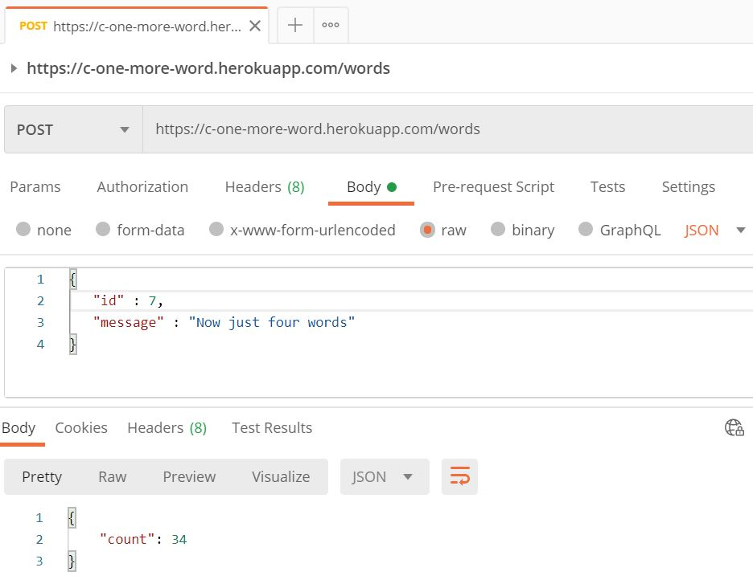
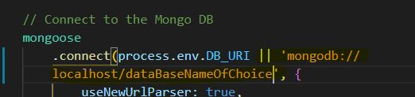

# One More Word
###### Description
This app creates an end point that receives a json object with two key value pairs: "id" and "message".  It returns a running total of the words submitted to the end point in the "message" field.

## Contributors
* mwturner611

## Table of Contents
* [Top of Page](#description)
* [Technologies Used](#technology)
* [Usage](#usage)
    * [Deployed](#deployed)
    * [Docker](#docker)
    * [Github](#github)
* [License](#license)
* [Contributing](#contributing)
* [Contacts](#contacts)

## Technology
* Docker
* Nodejs
* Express
* MongoDB - Atlas
* Mongoose
* Heroku 

## Usage 
#### Deployed Dockerized Example on Heroku 
1. "awaken" the heroku deployment by visiting [one-more-word-herokuapp.com](https://c-one-more-word.herokuapp.com/)
    * Expect to see a cheesy return of "Welcome to the word count!"
2. Use [postman](https://www.postman.com/) and submit a post route to add to the count and see the running total # of words submitted
    *  Request URL: https://c-one-more-word.herokuapp.com/words
    * Submission
        * Body
        * raw JSON
        * should include two fields, an "id" and "message".
    * Example submission:
        * {
            "id" : 10,
            "message" : "Cruella was surprisingly good"
        }
    * Example return:
        * {
            "count": 724
        }
3. Postman image example:

#### Docker: Pull Docker hub files
1. Navigate to [my docker hub page](https://hub.docker.com/search?q=mwturner611&type=image)
2. Pull two containers
    * mwturner611/one_more_word_web
    * mwturner611/mongo
3. While running locally they are on port 3000
    * To make sure it's working, navigate to: localhost:3000/
        * Expect to see "Welcome to the word count!"
    * To post use the postman example above for the deployed app, BUT replace the request URL with: localhost:3000/words

#### Github: Use this repo from my github, pull or fork 
1. Feel free to use this code as an example
2. To run this code on my machine I used:
    * Visual Studio code editor
    * Node v14.5.0
    * MongoDB v4.2.7
        * I managed my local database with Robo 3T 1.3.1
3. On pulling the code run npm install from root directory
4. For local development I updated the server.js file with local db path see image below:

    
## License
This project is licensed under The MIT License (MIT).

## Contributing Guidelines
All contributions and suggestions are welcome! For direct contributions, please fork the repository and file a pull request.

## Contacts
* Name: Matt Turner (@mwturner611)
* e-mail: mwturner611@gmail.com
* LinkedIn: https://www.linkedin.com/in/matt-turner-ba328211a/*# 